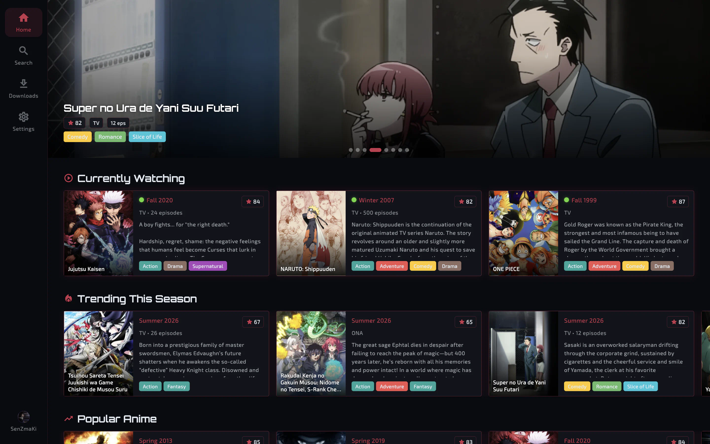
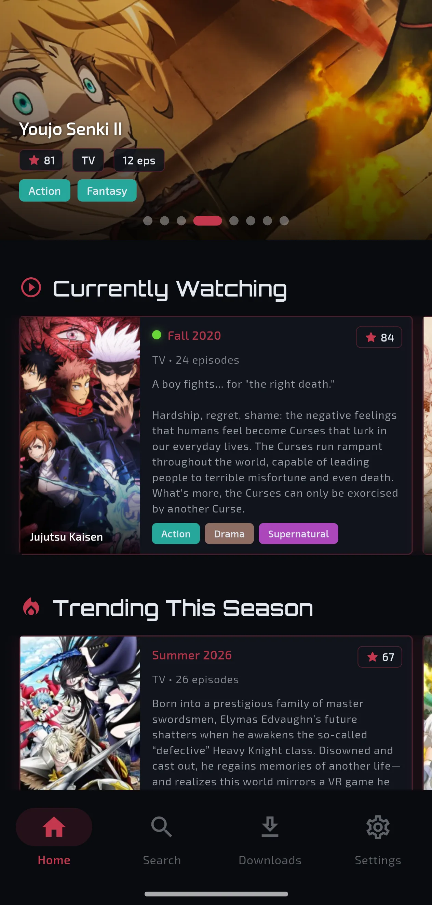

<h1 align="center">
   Senpwai
</h1>

<p align="center">
  A less annoying way to batch-download anime and keep up with new episodes.<br>
  Android · Linux · macOS · Windows
</p>

<p align="center">
  <a href="https://github.com/SenZmaKi/Senpwai/actions/workflows/ci.yml"></a>
  <a href="https://github.com/SenZmaKi/Senpwai/releases"></a>
  <a href="https://discord.com/invite/e9UxkuyDX2"></a>
  <a href="https://www.reddit.com/r/Senpwai"></a>
</p>

<p align="center">
  <a href="#installation">Installation</a> •
  <a href="#features">Features</a> •
  <a href="#building-from-source">Building from source</a> •
  <a href="#support">Support</a> •
  <a href="#faq">FAQ</a> •
  <a href="#links">Links</a> •
  <a href="#contribution">Contribution</a>
</p>

<table align="center">
  <tr>
    <td></td>
    <td></td>
  </tr>
</table>

## Installation

Get Senpwai for your device from the
[download page](https://senpwai.com/download). You can also browse every
version and its release notes on
[GitHub Releases](https://github.com/SenZmaKi/Senpwai/releases).

- **Windows 10/11:** x64 or ARM64 installer.
- **Linux:** x86_64 or aarch64 AppImage.
- **macOS:** one universal DMG for Apple Silicon and Intel.
- **Android:** ARM64, 32-bit ARM, or x64 APK.

## Features

- Discover and search anime through AniList. Filter results and optionally
  connect your AniList account to browse your library.
- Download from Animepahe, Tokyo Insider, and Nyaa. Choose
  the source, episode range, resolution, audio preference, and download folder.
- Scan your library to avoid downloading episodes you already have, optionally
  skip filler, and review uncertain Nyaa matches before queueing torrents.
- Pause, resume, and reorder downloads, with progress, speed, and torrent
  activity visible from the Downloads page.
- Track ongoing anime and automatically check for newly available episodes
  using each show's saved download choices.
- Customize themes, typography, and anime card layouts in an interface that
  adapts to phones, tablets, and desktops.

## Support

- Support development through [GitHub Sponsors](https://github.com/sponsors/SenZmaKi).
- Leave a star so more weebs can find Senpwai.
- Found a bug or have an idea? Open an issue or [contribute](#contribution).

## Sponsors

<p>
  <a href="https://github.com/KeithBoehler"></a>
</p>

## Building from Source

Install [Flutter](https://docs.flutter.dev/get-started/install) and the tooling
for your target platform, then run:

```sh
git clone https://github.com/SenZmaKi/Senpwai.git
cd Senpwai
flutter pub get
flutter run
```

Use `flutter build apk`, `flutter build linux`, `flutter build macos`, or
`flutter build windows` for a local build on a supported host. Release signing
and packaging are handled by the [release workflow](docs/releasing.md).

## FAQ

<details>
<summary>Why did you make this?</summary>

I couldn't afford Wi-Fi, so I used my college Wi-Fi to batch-download anime
after class. Downloading from streaming sites one episode at a time was a pain,
so I made Senpwai for myself and anyone else dealing with the same thing.

</details>

<details>
<summary>What happened to SenpCLI and the Python app?</summary>

Senpwai 3 is a Flutter rebuild for mobile and desktop. The old Python app and
SenpCLI are no longer part of this codebase; older releases remain in GitHub's
release history.

</details>

<details>
<summary>Do you intend to add more sources?</summary>

The current sources are Animepahe, Tokyo Insider, and Nyaa. New sources need
ongoing maintenance, so the focus is keeping these working well.

</details>

## Links

[Discord server](https://discord.com/invite/e9UxkuyDX2)

[Subreddit](https://reddit.com/r/Senpwai)

[GitHub Sponsors](https://github.com/sponsors/SenZmaKi)

## Contribution

- Open pull requests against `master` and run `flutter analyze` before submitting.
- Keep Flutter changes in `lib/`; the website lives in `website/`.
- See [release instructions](docs/releasing.md) and
  [signing-key guidance](docs/signing-keys.md) for packaging changes.

## Legal Disclaimer

Senpwai is designed to access publicly available content. It does not host
copyrighted content or control external sites. Respect copyright and the terms
of the services you use. For concerns about content on an external site, contact
that site's owner or operator.

## Epilogue

Truly one of the most apps ever of all time.
